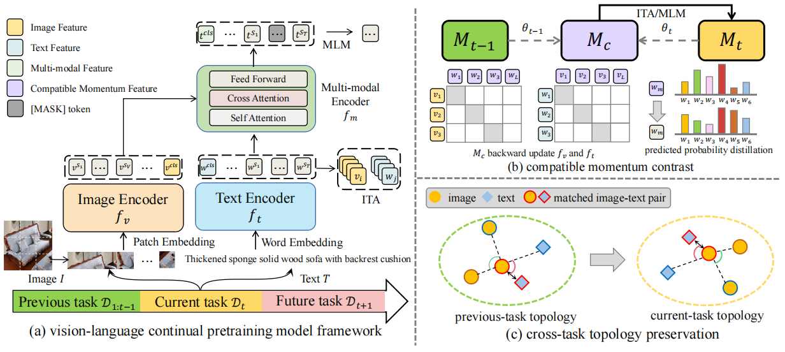

# CTP
[](https://github.com/KevinLight831/CTP/blob/main/LICENSE)
[](https://www.python.org/)
[](https://pytorch.org/) 

The repository is 

  1. A PyTorch library that provides some continual learning baseline algorithms on the vision-language continual pretraining benchmark P9D dataset.

  2. PyTorch implement for ICCV23 paper of *"[CTP: Towards Vision-Language Continual Pretraining via Compatible Momentum Contrast and Topology Preservation](https://arxiv.org/abs/2308.07146)"*.

## 🎨 Introduction 

Vision-Language Pretraining (VLP) has shown impressive results on diverse downstream tasks by offline training on large-scale datasets.
Regarding the growing nature of real-world data, such an offline training paradigm on ever-expanding data is unsustainable, because models lack the continual learning ability to accumulate knowledge constantly.
However, most continual learning studies are limited to uni-modal classification and existing multi-modal datasets cannot simulate continual non-stationary data stream scenarios. 

To support the study of Vision-Language Continual Pretraining (VLCP), we first contribute a comprehensive and unified benchmark dataset [P9D](https://github.com/KevinLight831/P9D) which contains over one million product image-text pairs from 9 industries. The data from each industry as an independent task supports continual learning and conforms to the real-world long-tail nature to simulate pretraining on web data. 

We comprehensively study the characteristics and challenges of VLCP, and propose a new algorithm: Compatible momentum contrast with Topology Preservation, dubbed [CTP](https://github.com/KevinLight831/CTP). The compatible momentum model absorbs the knowledge of the current and previous-task models to flexibly update the modal feature. Moreover, Topology Preservation transfers the knowledge of embedding across tasks while preserving the flexibility of feature adjustment.

<p align="center"></p>


## ⚙️ Setup and Environments

*  Python=3.7.15
*  PyTorch=1.11.0
*  Nvidia Driver Version=470.82.01 
*  CUDA Version=11.4

The detailed dependencies can refer to *requirements.txt*.
```
pip install -r requirements.txt
```
## :clipboard: Reimplemented Methods

The detailed introduction of each baseline method can refer to the appendix of our paper or the corresponding raw paper. 

Besides, the `train` folder provides the reimplemented codes on the vision-language continual pretraining task. Meanwhile, we also provide the training log of all methods as supplementary.

-  `SeqF`: Learning approach which learns each task incrementally while not using any data or knowledge from previous tasks.

-  `JointT`: Learning approach which has access to all data from previous tasks and serves as an upper bound baseline.

### **Memory-Free methods**: Baseline methods without exemplar replay.
-  `SI`: Continual learning through synaptic intelligence. [arxiv](https://arxiv.org/abs/1703.04200)
| [ICML 2017](http://proceedings.mlr.press/v70/zenke17a.html)
| [code](https://github.com/ganguli-lab/pathint)
-  `MAS`: Memory aware synapses: Learning what (not) to forget. [arxiv](https://arxiv.org/abs/1711.09601)
| [ECCV 2018](https://openaccess.thecvf.com/content_ECCV_2018/papers/Rahaf_Aljundi_Memory_Aware_Synapses_ECCV_2018_paper.pdf)
| [code](https://github.com/rahafaljundi/MAS-Memory-Aware-Synapses)
-  `EWC`: Overcoming catastrophic forgetting in neural networks. [arxiv](http://arxiv.org/abs/1612.00796)
| [PNAS 2017](https://www.pnas.org/content/114/13/3521)
-  `LWF`:  Learning without Forgetting. [arxiv](https://arxiv.org/abs/1606.09282)
| [TPAMI 2017](https://ieeexplore.ieee.org/document/8107520)

-  `AFEC`: AFEC: Active Forgetting of Negative Transfer in Continual Learning. [arxiv](https://arxiv.org/abs/2110.12187)
| [NeurIPS 2021](https://papers.nips.cc/paper/2021/file/bc6dc48b743dc5d013b1abaebd2faed2-Paper.pdf)
| [code](https://github.com/lywang3081/AFEC)
-  `RWalk`: Riemannian Walk for Incremental Learning: Understanding Forgetting and Intransigence.[ arxiv](https://arxiv.org/abs/1801.10112)
| [ECCV 2018](http://openaccess.thecvf.com/content_ECCV_2018/papers/Arslan_Chaudhry__Riemannian_Walk_ECCV_2018_paper.pdf)
| [code](https://github.com/facebookresearch/agem)

### **Memory-Buffer methods**: Baseline methods with exemplar replay.
-  `ER`: Continual learning with tiny episodic memories. [arxiv](https://arxiv.org/pdf/1902.10486v1.pdf)
| [code](https://github.com/facebookresearch/agem)
-  `MoF`: (Mean-of-Feature). The exemplar sampling methods used in [ICARL](https://arxiv.org/abs/1611.07725).
-  `Kmeans`: Use online k-Means to estimate the k centroids in feature space and update the exemplar buffer. It is documented in [arxiv](https://arxiv.org/pdf/1902.10486v1.pdf) as a comparative sampling method.
-  `ICARL`: Incremental Classifier and Representation Learning. [arxiv](https://arxiv.org/abs/1611.07725)
| [CVPR 2017](https://openaccess.thecvf.com/content_cvpr_2017/papers/Rebuffi_iCaRL_Incremental_Classifier_CVPR_2017_paper.pdf)
| [code](https://github.com/srebuffi/iCaRL)
-  `LUCIR`: Learning a Unified Classifier Incrementally via Rebalancing. [CVPR 2019](https://openaccess.thecvf.com/content_CVPR_2019/papers/Hou_Learning_a_Unified_Classifier_Incrementally_via_Rebalancing_CVPR_2019_paper.pdf)
| [code](https://github.com/hshustc/CVPR19_Incremental_Learning)

## :file_folder: Dataset

The details of P9D dataset can be found in [this repository](https://github.com/KevinLight831/P9D).

## 📥 Pretrained Model Weight 

The model weights of each method are too large. For example, each baseline method has model weights obtained from 8 tasks (2.3G*8=18.4G). As an alternative, we provide the training log of all baseline methods in the default and reversed task order. 

Meanwhile, we provide the download links of CTP and CTP_ER model weights which are trained in the default task order. The link to Google Driver only has the model weights of the final task, but the link to Baidu Netdisk has the model weights of each task.

|     | training log | model weights|
|:-------- |:------------:|:------------:| 
|Google Driver| [Here](https://drive.google.com/drive/folders/1reVJjcyZqja7_GXMArJ1vnpZbt9pwjsF?usp=drive_link) | [Here](https://drive.google.com/drive/folders/1S64MUDOmPlmJgALbCLDQyxzsrZp8ELdp?usp=drive_link) |  
|Baidu Netdisk| [Here](https://pan.baidu.com/s/1bUl_Ndch-P6QQ299bPmrBQ?pwd=kjw6)| [Here](https://pan.baidu.com/s/1I1_SvHpZF8MOzNE_9tEV_A?pwd=6b89)|  

## :mag: Train and Evaluation
### **Training from Scratch:**
1. Modify the file paths of the dataset in `configs/base_seqF.yaml` to your path.
2. Modify the **LOG_NAME** and **OUT_DIR** in `shell/seq_xxx.sh` to your storage path. `xxx` represents the name of the method.
3. Change the current path to the `shell` folder, and run the corresponding scripts `seq_xxx.sh`.
    ```
    cd /shell/
    sh seq_xxx.sh
    ```
4. The corresponding training log will be written in the `logger` folder.
   
### **Evaluation:**
1. Modify the **LOG_NAME** and **OUT_DIR** in `eval.sh` to the storage path of the trained model. 
2. Run the evaluation script `eval.sh`.
    ```
    sh eval.sh
    ```

## :pencil: Citation
If this codebase is useful to you, please cite our work:
```
@article{zhu2023ctp,
  title={CTP: Towards Vision-Language Continual Pretraining via Compatible
Momentum Contrast and Topology Preservation},
  author={Hongguang Zhu and Yunchao Wei and Xiaodan Liang and Chunjie Zhang and Yao Zhao},
  journal={Proceedings of the IEEE International Conference on Computer Vision},
  year={2023},
}
```

## :panda_face: Contacts
If you have any questions, please feel free to contact me: zhuhongguang1103@gmail.com or hongguang@bjtu.edu.cn.

## :books: Reference
1. Li, Junnan, et al. "[Align before Fuse: Vision and Language Representation Learning with Momentum Distillation.](https://github.com/salesforce/ALBEF)" NeurIPS. 2021.
2. Masana, Marc, et al. "[Class-Incremental Learning: Survey and Performance Evaluation on Image Classification.](https://github.com/mmasana/FACIL)" TPAMI. 2023.
3. Zhou, Dawei, et al. "[PyCIL: a Python toolbox for class-incremental learning.](https://github.com/G-U-N/PyCIL)" SCIENCE CHINA Information Sciences. 2023.
4. Hong, Xiaopeng, et al. "[An Incremental Learning, Continual Learning, and Life-Long Learning Repository](https://github.com/Vision-Intelligence-and-Robots-Group/Best-Incremental-Learning)". Github repository
5. Wang, Liyuan, et al. "[A Comprehensive Survey of Continual Learning: Theory, Method and Application](https://arxiv.org/abs/2302.00487)". arxiv 2023
